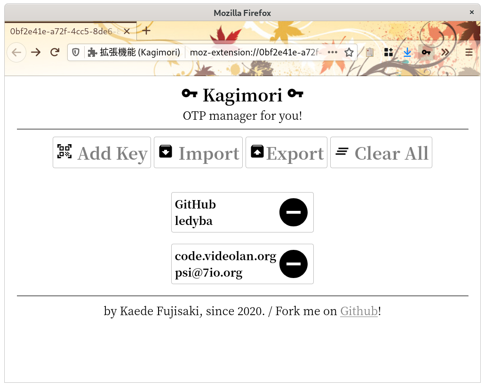
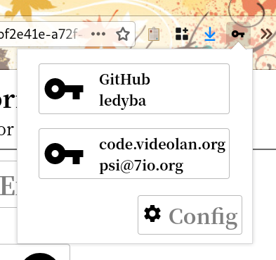
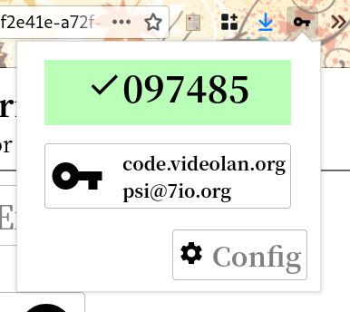

# Kagimori

**Kagimori** is a browser extension to manage TOTP(Time-based One Time Password) keys. You can use this extension as an alternative to smartphone apps.

## Features

 - Generate TOTP from your browser.
 - Add new keys from QR code images.
 - Import/Export keys.
 - Sync keys across devices!

## Screenshots

## Downlaod from store

In progres....

## Acknoledgement

### extension icon

From [https://www.hiclipart.com/free-transparent-background-png-clipart-ddehg](hiclipart).

### other icons

From [Icons - Material Design](https://material.io/resources/icons/).

# License

GPLv3 or later.
